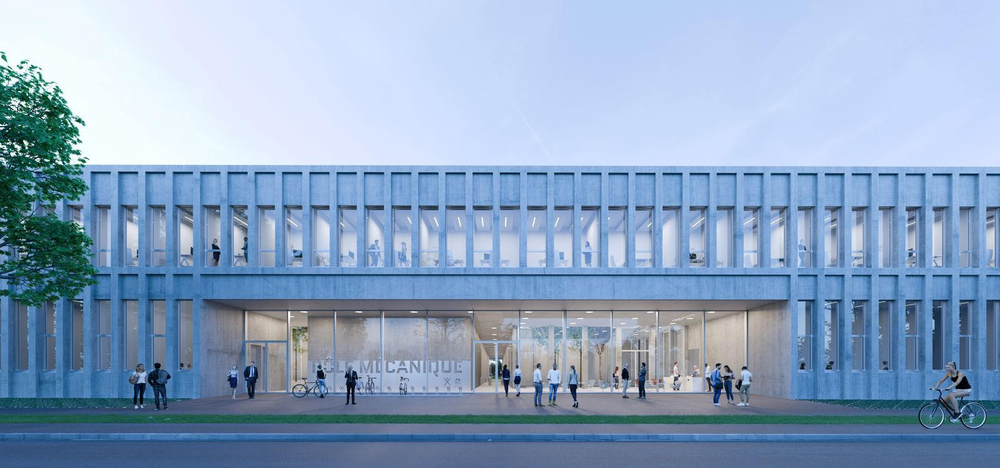
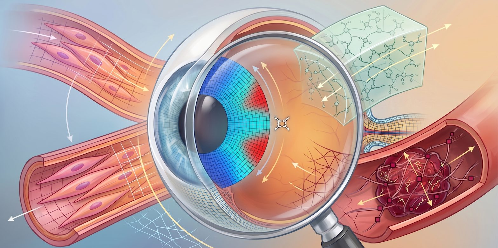

<!-- the above site verif should be updated -->

<style>
  /* The title is drawn on the hero picture: hide Quarto's default title block */
  #title-block-header { display: none; }
</style>

<!-- =====================================================================
     1. HERO — LMS building
     The  uses srcset so phones download the 900 px version and large
     screens the 2400 px one. Framing rules are in styles.css (.stm-hero).
     ===================================================================== -->
```{=html}
<section class="stm-hero" aria-label="LMS building">
  
  <div class="stm-hero-text">
    <p class="stm-kicker">Laboratoire de Mécanique des Solides · École polytechnique · IP Paris</p>
    <h1>Soft Tissue Biomechanics Group @ <a href="https://lms.ip-paris.fr/">LMS</a></h1>
    <p class="stm-tagline">Mechanics of living soft tissues — from microstructure to clinics.</p>
  </div>
</section>
```

:::::: {.stm-home-body}
::::: {.grid .stm-home-grid .align-items-center}

:::: {.g-col-12 .g-col-lg-6 .reveal .reveal-left}

[Welcome,]{.h2 .d-block .stm-welcome}

to the Soft Tissue Biomechanics research group. We are a dedicated multidisciplinary group within the [Laboratoire de Mécanique des Solides (LMS)](https://lms.ip-paris.fr/) at [Institut Polytechnique de Paris](https://www.ip-paris.fr/en).

Our primary scientific mission is to advance healthcare by bridging the gap between engineering and medicine. We apply rigorous **mechanics-dominant methodologies**—combining advanced experimental characterization with predictive computational modeling—to decipher the complex physical behavior of biological soft tissues across multiple scales. From understanding the mechanical pathways of pathology to designing biomimetic materials, we transform physical insights into biomedical innovations.

```{=html}
<div class="mt-4 d-flex flex-wrap justify-content-start align-items-center gap-2">
  <a href="research.html" class="btn btn-outline-primary btn-sm" role="button">Learn more about our Research</a>
  <a href="members.html" class="btn btn-outline-primary btn-sm" role="button">Meet the group @ LMS</a>
  <a href="https://src.koda.cnrs.fr/lms1" class="btn btn-outline-secondary btn-sm" role="button"><iconify-icon icon="fa6-brands:gitlab"></iconify-icon> GitLab</a>
</div>
```
::::

:::: {.g-col-12 .g-col-lg-6 .reveal .reveal-right}
<!-- =====================================================================
     2. CAROUSEL — ongoing projects
     To add / change a slide: copy one <div class="stm-slide"> block and
     change the image, texts and link (dots are generated automatically).
     Only the first slide carries the "is-active" class.
     Images are cropped to 16:10 (4:3 on phones): landscape pictures work best.
     ===================================================================== -->
```{=html}
<div id="projectCarousel" class="stm-carousel" data-interval="6000"
     role="region" aria-roledescription="carousel" aria-label="Ongoing projects">
  <div class="stm-slides">

    <div class="stm-slide is-active">
      
      <div class="stm-caption">
        <span class="stm-chip">Ongoing project</span>
        <h3>Corneal Mechanics &amp; Refractive Surgery</h3>
        <p>Microstructure-informed models and OCT-based testing of the human cornea.</p>
        <a class="stm-more" href="research.html#cornea">Discover the project →</a>
      </div>
    </div>

    <div class="stm-slide">
      
      <div class="stm-caption">
        <span class="stm-chip">Ongoing project</span>
        <h3>Full Ocular Mechanics &amp; Myopia</h3>
        <p>Patient-specific eye models to understand myopia progression.</p>
        <a class="stm-more" href="research.html#eye">Discover the project →</a>
      </div>
    </div>

    <div class="stm-slide">
      
      <div class="stm-caption">
        <span class="stm-chip">Ongoing project</span>
        <h3>Mechanics of Blood Clots</h3>
        <p>Microrheology of venous clots to diagnose hypercoagulability.</p>
        <a class="stm-more" href="research.html#clot">Discover the project →</a>
      </div>
    </div>

    <div class="stm-slide">
      
      <div class="stm-caption">
        <span class="stm-chip">Ongoing project</span>
        <h3>Vessels-on-a-Chip</h3>
        <p>Collagen-hydrogel platforms to study patient-specific vascular cells.</p>
        <a class="stm-more" href="research.html#vascular">Discover the project →</a>
      </div>
    </div>

    <div class="stm-slide">
      
      <div class="stm-caption">
        <span class="stm-chip">Ongoing project</span>
        <h3>Magneto-Active Biomaterials</h3>
        <p>Magnetic hydrogels to mechanically stimulate smooth muscle cells in 3D.</p>
        <a class="stm-more" href="research.html#magneto">Discover the project →</a>
      </div>
    </div>

    <div class="stm-slide">
      
      <div class="stm-caption">
        <span class="stm-chip">Ongoing project</span>
        <h3>Soft Matter &amp; Numerical Methods</h3>
        <p>Poro-visco-elasticity, DVC and 3D traction force microscopy.</p>
        <a class="stm-more" href="research.html#others">Discover the project →</a>
      </div>
    </div>

  </div>
  <button class="stm-nav stm-prev" type="button" aria-label="Previous slide">&#8249;</button>
  <button class="stm-nav stm-next" type="button" aria-label="Next slide">&#8250;</button>
  <div class="stm-dots" role="tablist"></div>
  <div class="stm-progress"><span></span></div>
</div>

<script>
  /* Subtle parallax on the hero picture (desktop only, honours reduced-motion) */
  (function () {
    var img = document.querySelector('.stm-hero-img');
    if (!img || window.matchMedia('(prefers-reduced-motion: reduce)').matches) return;
    var ticking = false;
    window.addEventListener('scroll', function () {
      if (ticking || window.innerWidth < 768) return;
      ticking = true;
      requestAnimationFrame(function () {
        var y = Math.min(window.scrollY, 800);
        img.style.transform = 'translateY(' + (y * 0.25) + 'px) scale(1.04)';
        ticking = false;
      });
    }, { passive: true });
  })();

  /* Project carousel: autoplay, fade + slow zoom, dots, arrows, swipe, keyboard */
  (function () {
    var root = document.getElementById('projectCarousel');
    if (!root) return;
    var slides = root.querySelectorAll('.stm-slide');
    var dotsBox = root.querySelector('.stm-dots');
    var bar = root.querySelector('.stm-progress span');
    var delay = +root.dataset.interval || 6000;
    var i = 0, timer = null, t0 = 0, paused = false, raf;

    slides.forEach(function (s, k) {
      var d = document.createElement('button');
      d.type = 'button'; d.setAttribute('aria-label', 'Go to slide ' + (k + 1));
      d.addEventListener('click', function () { go(k); });
      dotsBox.appendChild(d);
    });
    var dots = dotsBox.querySelectorAll('button');

    function go(k) {
      slides[i].classList.remove('is-active'); dots[i].classList.remove('active');
      i = (k + slides.length) % slides.length;
      slides[i].classList.add('is-active'); dots[i].classList.add('active');
      t0 = performance.now();
    }
    function tick(now) {
      if (!paused) {
        var p = (now - t0) / delay;
        if (p >= 1) { go(i + 1); p = 0; }
        bar.style.width = (p * 100) + '%';
      } else { t0 = now - (parseFloat(bar.style.width) || 0) / 100 * delay; }
      raf = requestAnimationFrame(tick);
    }
    dots[0].classList.add('active'); t0 = performance.now(); raf = requestAnimationFrame(tick);

    root.querySelector('.stm-prev').addEventListener('click', function () { go(i - 1); });
    root.querySelector('.stm-next').addEventListener('click', function () { go(i + 1); });
    root.addEventListener('mouseenter', function () { paused = true; });
    root.addEventListener('mouseleave', function () { paused = false; });
    root.addEventListener('focusin', function () { paused = true; });
    root.addEventListener('focusout', function () { paused = false; });
    root.tabIndex = 0;
    root.addEventListener('keydown', function (e) {
      if (e.key === 'ArrowLeft') go(i - 1);
      if (e.key === 'ArrowRight') go(i + 1);
    });
    var x0 = null;
    root.addEventListener('touchstart', function (e) { x0 = e.touches[0].clientX; }, { passive: true });
    root.addEventListener('touchend', function (e) {
      if (x0 === null) return;
      var dx = e.changedTouches[0].clientX - x0;
      if (Math.abs(dx) > 40) go(i + (dx < 0 ? 1 : -1));
      x0 = null;
    });
    document.addEventListener('visibilitychange', function () { paused = document.hidden; });
  })();
</script>
```
::::

:::::
::::::
