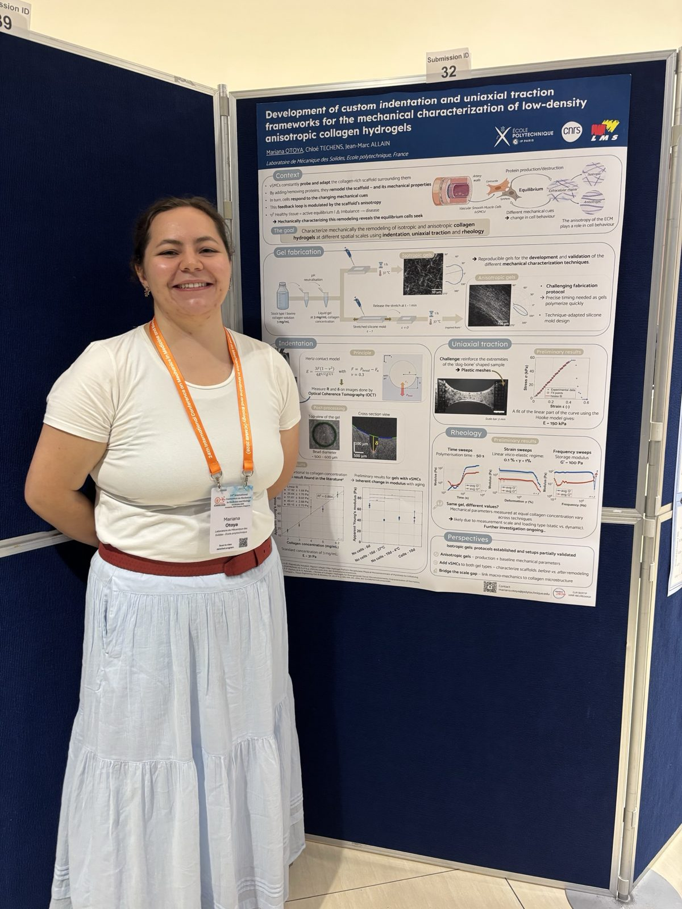

:::{#hero-heading}
:::

## Event Summary

From **6 to 8 October 2026**, **Mariana Otoya** and **Chloé Techens** are representing the group at the **24th International Conference on Mechanics in Medicine and Biology (ICMMB 2026)**, held at the Academia, SGH Campus, in **Singapore**.

They are presenting two complementary contributions on how the mechanical environment of vascular smooth muscle cells can be characterized and controlled. If you are attending, come and meet them!

### Poster by Mariana Otoya (Submission ID 32)

> **Development of custom indentation and uniaxial traction frameworks for the mechanical characterization of low-density anisotropic collagen hydrogels**
>
> *Mariana Otoya, Chloé Techens, Jean-Marc Allain* — Laboratoire de Mécanique des Solides, École polytechnique

Vascular smooth muscle cells constantly probe and remodel the collagen-rich scaffold that surrounds them, and the anisotropy of this extracellular matrix plays a key role in their behaviour. To characterize this remodeling mechanically, Mariana presents the frameworks she developed to fabricate reproducible **isotropic and anisotropic collagen gels** and to test them at different spatial scales using:

* **Indentation**, with contact geometry measured by Optical Coherence Tomography (OCT);
* **Uniaxial traction**, on reinforced "dog-bone" shaped samples;
* **Rheology** (time, strain and frequency sweeps).

{fig-align="center" width="60%"}

### Presentation by Chloé Techens

> **Magnetically actuated hydrogels for mechanically stimulating smooth muscle cells**
>
> *Guillaume Lafitte, Jules Introvigne, Jean Boisson, Chloé Techens* — Laboratoire de Mécanique des Solides, École polytechnique & LMI, ENSTA

On her side, Chloé presents the progress made by **Guillaume Lafitte** and **Jules Introvigne** in the development of **magnetic hydrogels**: soft substrates that can be deformed remotely with a magnetic field, which lets us apply controlled mechanical stimuli to smooth muscle cells cultured with them. This project is carried out in collaboration with **Jean Boisson** (LMI, ENSTA).
