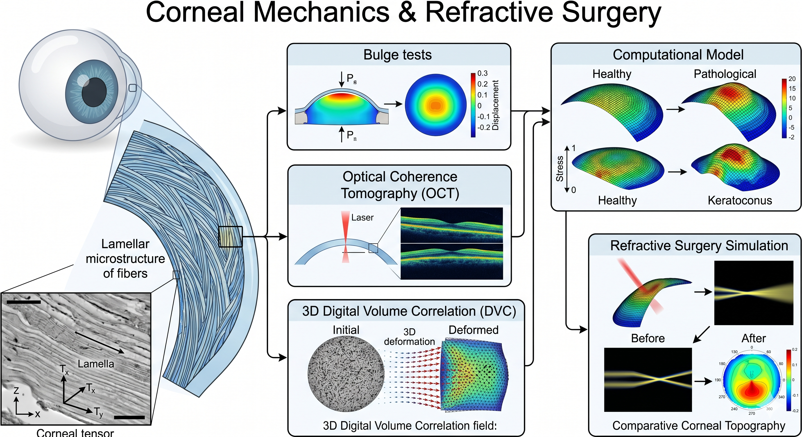
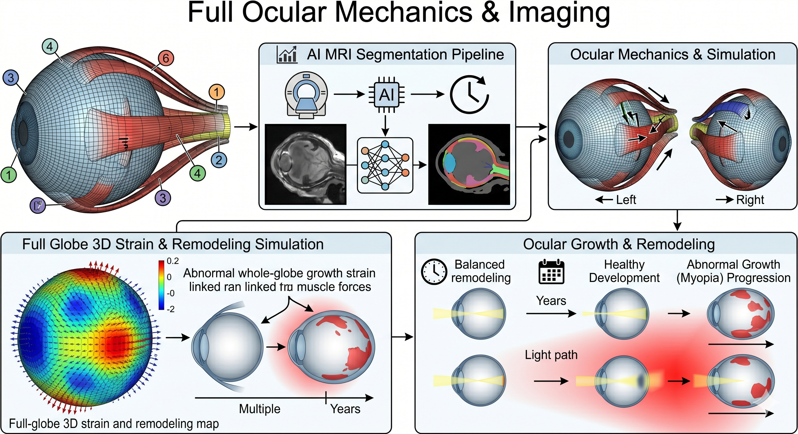
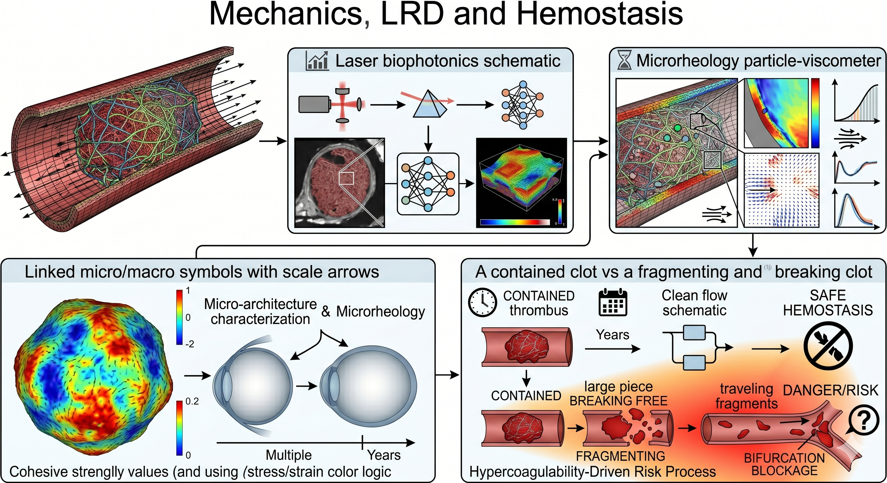
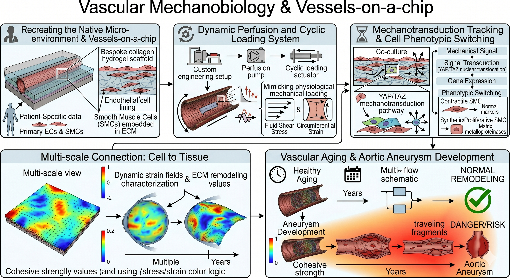
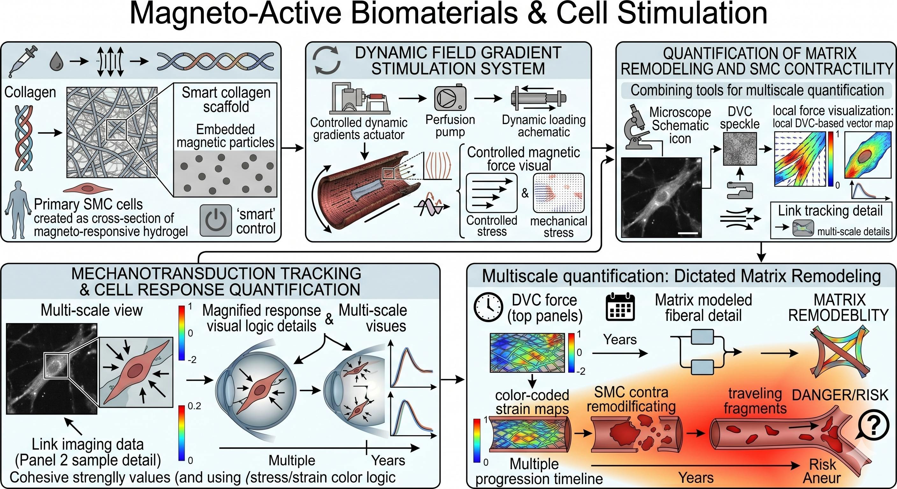
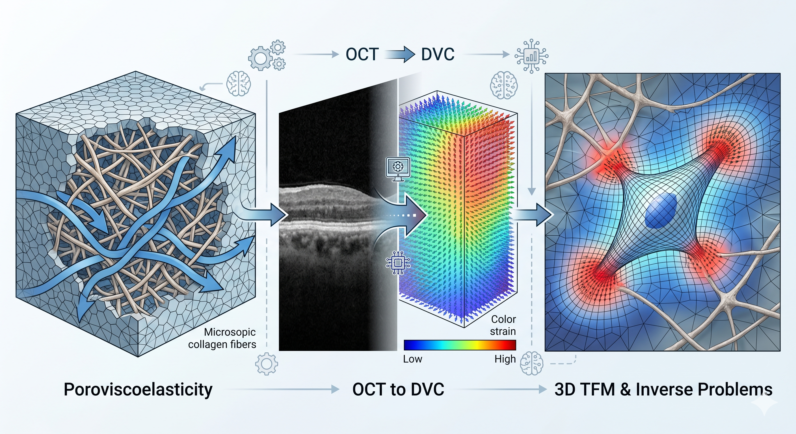

::: {.lead}
Our group specializes in the continuum mechanics of soft, living, and active materials. By bridging experimental characterization, advanced bioimaging, and state-of-the-art computational modeling, we tackle critical challenges in physiology, mechanobiology, and tissue engineering.
:::

```{=html}
<div id="stm-progress"></div>
```

<!-- Sticky menu: the active entry follows the scroll (see script at the bottom) -->
::: {.stm-subnav}
<a href="#cornea">👁️ Cornea Mechanics</a>
<a href="#eye">👁️‍🗨️ Ocular Mechanics</a>
<a href="#clot">🩸 Blood Clots</a>
<a href="#vascular">🧫 Vessels-on-a-Chip</a>
<a href="#magneto">🧲 Magneto-Active Biomaterials</a>
<a href="#others">🔬 Soft Matter & Methods</a>
:::

::::::: {#cornea .project-section}
:::::: {.grid .align-items-center}
::::: {.g-col-12 .g-col-md-5 .project-media .reveal .reveal-left}
:::: {.project-figure}
{width="100%" fig-alt="Cornea"}
::::
:::::
::::: {.g-col-12 .g-col-md-7 .reveal}
[01 / 06 · Cornea]{.stm-num}

## Corneal Mechanics & Refractive Surgery

We investigate the intricate lamellar microstructure of the healthy and pathological cornea to predict its response to surgical interventions and degenerative diseases. Our multiscale approach combines advanced experimental testing (bulge tests, Optical Coherence Tomography, and 3D Digital Volume Correlation) with custom, microstructure-informed finite element models to characterize anisotropy, structural gradients, and active collagen remodeling.

**Key topics:** [Corneal Anisotropy]{.badge .border .border-secondary .text-secondary .mb-1} 
[OCT & DVC Imaging]{.badge .border .border-secondary .text-secondary .mb-1} 
[Refractive Surgery Simulation]{.badge .border .border-secondary .text-secondary .mb-1}


:::: {.project-pubs data-tags="Cornea"}
::::

[📚 View relevant publications](publications.html?tag=Cornea){.btn .btn-sm .btn-primary .mt-3 .project-pubs-btn}
:::::
::::::
:::::::

::::::: {#eye .project-section .flip}
:::::: {.grid .align-items-center}
::::: {.g-col-12 .g-col-md-5 .project-media .reveal .reveal-right}
:::: {.project-figure}
{width="100%" fig-alt="Ocular mechanics"}
::::
:::::
::::: {.g-col-12 .g-col-md-7 .reveal}
[02 / 06 · Ocular mechanics]{.stm-num}

## Full Ocular Mechanics & Imaging

Beyond the cornea, we model the mechanical environment of the entire eye globe. This includes utilizing AI-based segmentation on MRI data to generate patient-specific meshes of the eye and extraocular muscles. By simulating muscular contraction, we characterize the influence of eye movements on long-term ocular growth, remodeling, and the epidemic progression of myopia during childhood, paving the way for medical optics interventions.

**Key topics:** [Extraocular Muscles & Myopia]{.badge .border .border-secondary .text-secondary .mb-1} 
[AI MRI Segmentation]{.badge .border .border-secondary .text-secondary .mb-1} 
[Growth & Remodeling]{.badge .border .border-secondary .text-secondary .mb-1}


:::: {.project-pubs data-tags="Eye"}
::::

[📚 View relevant publications](publications.html?tag=Eye){.btn .btn-sm .btn-primary .mt-3 .project-pubs-btn}
:::::
::::::
:::::::

::::::: {#clot .project-section}
:::::: {.grid .align-items-center}
::::: {.g-col-12 .g-col-md-5 .project-media .reveal .reveal-left}
:::: {.project-figure}
{width="100%" fig-alt="Blood clots"}
::::
:::::
::::: {.g-col-12 .g-col-md-7 .reveal}
[03 / 06 · Blood clots]{.stm-num}

## Mechanics of Blood Clots & Hemostasis

Understanding the mechanics of thrombus formation and dissolution is crucial for diagnosing and tackling cardiovascular diseases. By coupling solid mechanics with advanced optical tools (biophotonics), we characterize the 3D microstructural architecture and microrheology of venous blood clots. Our multiscale approach quantifies fibrin network hypercoagulability to predict clot stability and embolization risks under physiological conditions.

**Key topics:** [Venous Microrheology]{.badge .border .border-secondary .text-secondary .mb-1} 
[Thrombus Visco-hyperelasticity]{.badge .border .border-secondary .text-secondary .mb-1} 
[Hypercoagulability]{.badge .border .border-secondary .text-secondary .mb-1} 


:::: {.project-pubs data-tags="Clot"}
::::

[📚 View relevant publications](publications.html?tag=Clot){.btn .btn-sm .btn-primary .mt-3 .project-pubs-btn}
:::::
::::::
:::::::

::::::: {#vascular .project-section .flip}
:::::: {.grid .align-items-center}
::::: {.g-col-12 .g-col-md-5 .project-media .reveal .reveal-right}
:::: {.project-figure}
{width="100%" fig-alt="Vessels-on-a-chip"}
::::
:::::
::::: {.g-col-12 .g-col-md-7 .reveal}
[04 / 06 · Vessels-on-a-chip]{.stm-num}

## Vascular Mechanobiology & Vessels-on-a-Chip

To recreate the native cellular microenvironment, we develop *in vitro* vascular platforms (vessels-on-a-chip) utilizing bespoke collagen hydrogels. These platforms allow us to study the patient-specific mechanobiology of human primary Smooth Muscle Cells (SMCs) and Endothelial Cells. By engineering dynamic cyclic perfusion systems, we mimic physiological mechanical loading and track mechanotransduction pathways—such as YAP/TAZ—that drive vascular aging, phenotypic switching, and aortic aneurysms.

**Key topics:** [Vessels-on-a-chip]{.badge .border .border-secondary .text-secondary .mb-1} 
[Patient-Specific Mechanobiology]{.badge .border .border-secondary .text-secondary .mb-1} 
[Endothelial Crosstalk]{.badge .border .border-secondary .text-secondary .mb-1}


:::: {.project-pubs data-tags="Hydrogel,Vascular"}
::::

[📚 View relevant publications](publications.html?tag=Hydrogel,Vascular){.btn .btn-sm .btn-primary .mt-3 .project-pubs-btn}
:::::
::::::
:::::::

::::::: {#magneto .project-section}
:::::: {.grid .align-items-center}
::::: {.g-col-12 .g-col-md-5 .project-media .reveal .reveal-left}
:::: {.project-figure}
{width="100%" fig-alt="Magneto-active biomaterials"}
::::
:::::
::::: {.g-col-12 .g-col-md-7 .reveal}
[05 / 06 · Magneto-active biomaterials]{.stm-num}

## Magneto-Active Biomaterials & Cell Stimulation

To isolate the effect of 3D mechanical stress on cellular behavior, we engineer smart, magneto-responsive hydrogels. By embedding magnetic nanoparticles (Fe3O4) within collagen matrices, we can apply highly controlled, dynamic field gradients to stimulate resident cells. Coupled with multiphoton microscopy and Digital Volume Correlation, this novel platform allows us to precisely quantify how local mechanical forces dictate matrix remodeling and SMC contractility.

**Key topics:** [Magneto-responsive Hydrogels]{.badge .border .border-secondary .text-secondary .mb-1} 
[Matrix Remodeling]{.badge .border .border-secondary .text-secondary .mb-1} 


:::: {.project-pubs data-tags="Hydrogel,Magnetic"}
::::

[📚 View relevant publications](publications.html?tag=Hydrogel,Magnetic){.btn .btn-sm .btn-primary .mt-3 .project-pubs-btn}
:::::
::::::
:::::::

::::::: {#others .project-section .flip}
:::::: {.grid .align-items-center}
::::: {.g-col-12 .g-col-md-5 .project-media .reveal .reveal-right}
:::: {.project-figure}
{width="100%" fig-alt="Methods"}
::::
:::::
::::: {.g-col-12 .g-col-md-7 .reveal}
[06 / 06 · Methods]{.stm-num}

## Soft Matter Mechanics & Advanced Numerical Methods

We push the boundaries of computational mechanics to decipher complex biological interactions. Our work includes multi-scale poroviscoelastic modeling of living tissues and hydrogels, capturing the dynamics of interstitial fluid and fibrillar architectures. By coupling 3D Digital Volume Correlation (DVC) on high-resolution OCT images with inverse problem frameworks, we successfully map local tissue deformations. This fuels our pioneering work in 3D Traction Force Microscopy (TFM), allowing us to measure the exact micromechanical stresses exerted by cells within their 3D native environment. 

**Key topics:** [3D Traction Force Microscopy]{.badge .border .border-secondary .text-secondary .mb-1} 
[Poroviscoelasticity]{.badge .border .border-secondary .text-secondary .mb-1} 
[Inverse Problems]{.badge .border .border-secondary .text-secondary .mb-1}


:::: {.project-pubs data-tags="Others"}
::::

[📚 View relevant publications](publications.html?tag=Others){.btn .btn-sm .btn-primary .mt-3 .project-pubs-btn}
:::::
::::::
:::::::

<!-- Related publications come from resources/biblio/bibliography.yml:
     a paper appears under a project when one of its `tags` matches data-tags. -->
<script src="resources/pages_style/publications.js"></script>
<script>
  /* Scroll-spy for the sticky menu + reading progress bar */
  (function () {
    var links = Array.prototype.slice.call(document.querySelectorAll('.stm-subnav a'));
    var bar = document.getElementById('stm-progress');
    var sections = links.map(function (a) { return document.getElementById(a.hash.slice(1)); }).filter(Boolean);
    function onScroll() {
      var h = document.documentElement;
      bar.style.width = (100 * h.scrollTop / Math.max(1, h.scrollHeight - h.clientHeight)) + '%';
      var y = window.scrollY + window.innerHeight * 0.35, cur = null;
      sections.forEach(function (s) { if (s.getBoundingClientRect().top + window.scrollY <= y) cur = s.id; });
      links.forEach(function (a) {
        var on = a.hash === '#' + cur;
        if (on && !a.classList.contains('active')) a.scrollIntoView({ block: 'nearest', inline: 'center' });
        a.classList.toggle('active', on);
      });
    }
    window.addEventListener('scroll', onScroll, { passive: true });
    onScroll();
  })();
</script>
